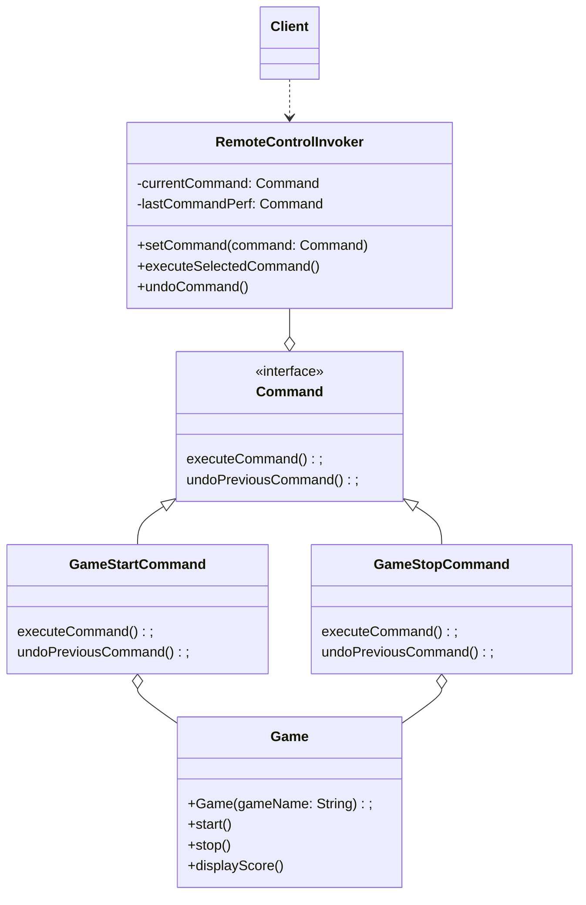

## Introduction

- Command is a behavioral design pattern that turns a request into a stand-alone object that contains all information about the request.

- This patterns is often used in a multithreaded environment.

::: info GOF Definition
It encapsulates a request as an object, thereby letting you parameterize clients with different requests, queue or log requests, and support undoable operations.
:::

## Terms

- There are four important terms: invoker, client, command, and receiver.

- **Command:** Defines an interface for executing an operation.

- **Concrete Command:** Implements the Command interface and encapsulates the receiver object (the object that performs the action) and the action itself.

- **Receiver:** Performs the actual action associated with a command.

- **Invoker:** Asks the command to carry out the request.

## Process

- A command object can invoke a method of the receiver in a way that is specific to that receiver's class. The receiver then starts processing the job.

- A `command` object is separately passed to `invoker` object to invoke the command. The `invoker` object contains those crystallized methods through which a client can perform a job without worrying about how the actual job is performed by the target receiver.

- The client object holds the `invoker` object and the `command` objects. The client must decide which commands to execute before it passes the appropriate `command` to the `invoker` object.

## Example

- Imagine a game where players can start and stop the game, and view the current score. We want to implement a system that allows flexible execution of these commands while keeping the sender(refers to the object that requests the execution of a command) and receiver(refers to the object that performs the actual action associated with the command) decoupled.

- The `Game` class represents the receiver. It contains methods such as `start()`, `stop()`, and `displayScore()` that perform actions related to the game, such as starting the game, stopping the game, and displaying the score.

- The `Command` class represents the `Command` interface. It declares the `executeCommand()` method, which is responsible for executing a command, and the `undoPreviousCommand()` method, which undoes the previous command. This class acts as the contract for all concrete command classes.

- The `GameStartCommand` and `GameStopCommand` classes are concrete implementations of the Command interface. Each class encapsulates a specific action: starting or stopping a game. These classes define their own `executeCommand()` and `undoPreviousCommand()` methods.

- The RemoteControlInvoker class acts as the invoker. It holds a reference to the current command and the last command performed. It has methods to set a command, execute the selected command, and undo the previous command.

- in this example, the Command Pattern allows the RemoteControlInvoker to set and execute commands (such as starting or stopping the game) without knowing the specific details of the commands or the receiver. The invoker can also undo the previous command if needed. This decouples the invoker from the actual execution and provides flexibility and extensibility in managing game commands.

### Enhancements

- Inside the invoker class, you can maintain an ArrayList object(savedCommands) to store all the commands that you execute. Whenever a command is executed, it is added to this list.

- Once an undo operation is called, it is removed from from the saved command list too.

- A method called `undoAllStoredCommand()` can be used to iterate over the savedCommand list and call the corresponding undo operations.

### UML Diagram

<Replit user="samsandy111999" repl="commandpattern" file="Main.java"/>
