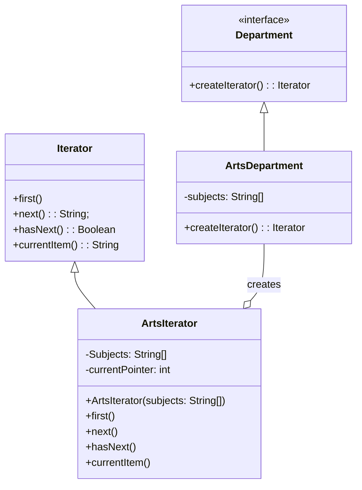

## Introduction

- Iterator is a behavioral design pattern that lets you traverse elements of a collection without exposing its underlying representation.

- The main idea of the Iterator pattern is to extract the traversal behavior of a collection into a separate object called an iterator.

:::info GOF Definition
It provides a way to access the elements of an aggregate object sequentially without exposing its underlying representation.
:::

## Terms

- _Iterator_: This is an interface or an abstract class that defines the methods for accessing the elements of a collection. It typically includes methods like `next()`, `hasNext()`, and possibly `remove()` for modifying the underlying collection.

- _Concrete Iterator_: This is a concrete implementation of the Iterator interface that provides the actual implementation of the iteration methods. It maintains the current position within the collection and allows iteration over the elements.

- _Aggregate_: This is the interface or abstract class that defines the methods for creating an iterator. It may also include methods for accessing the elements of the collection directly, but the iterator provides a more controlled and standardized way of traversing the collection.

- _Concrete Aggregate_: This is a concrete implementation of the Aggregate interface that creates an instance of the corresponding iterator and associates it with the specific collection. It provides the iterator implementation for that collection.

## When to use ?

- _Traversing a complex data structure:_ When you have a data structure that is not traversable via for loop and you can't gt an internal reference to the elements but you still need to retrieve elements in a loop fashion.

- _Using different traversal methods:_ When you have a data structure or a data model that you want to iterate in multiple ways and orderings such as forward, backward, or in pairs, then instead of creating manual loops over each case, you expose an Iterator interface that can be used to traverse the elements in the right order.

## Real World Usage

- The Iterator pattern is widely used in various programming languages and frameworks, including Java's `Iterator` interface and the `enhanced for-loop` construct, C#'s `IEnumerable` interface and `foreach` loop, and Python's `iterator protocol` and `for` loop. It simplifies the process of iterating over collections and provides a consistent and unified way of accessing elements regardless of the specific collection implementation.

## Example

- Suppose, we have an Arts Department that offers various subjects. We want to provide an iterator to iterate over these subjects. The Iterator pattern allows us to encapsulate the iteration logic and provide a consistent way of accessing the subjects without exposing the underlying implementation.

Here's a brief overview of the classes:

- _Iterator_: This class represents the iterator interface. It defines the methods first(), next(), hasNext(), and currentItem(). These methods provide the standard iterator operations like moving to the first item, moving to the next item, checking if there are more items, and getting the current item.

- _ArtsIterator_: This class implements the Iterator interface and provides the concrete implementation for iterating over the subjects in the Arts Department. It maintains an array of subjects (Subjects) and a pointer to keep track of the current position (currentPointer). The methods first(), next(), hasNext(), and currentItem() are implemented based on the Arts Department's subject array.

- _Department_: This is an interface that defines the createIterator() method. It acts as the abstract representation of a department and declares the method for creating an iterator.

- _ArtsDepartment_: This class represents the Arts Department. It maintains an array of subjects (subjects). It implements the createIterator() method, which creates an instance of ArtsIterator and returns it. This class establishes a relationship with ArtsIterator.

### UML Diagram



### Implementation - 1(Using our own Iterator Interface)

:::: details Code

```java
interface Department {
     Iterator createIterator();
}
```

```java
class ArtsDepartment implements Department{
     private String[] subjects;
     public ArtsDepartment() {
         subjects = new String[] {
            "1. English",
            "2. History",
            "3. Geography",
            "4. Psychology"
         };
     }
     public Iterator createIterator() {
          return new ArtsIterator(subjects);
     }
}
```

```java
interface Iterator {
     void first(); // Reset to first element
     String next(); // To get the next element
     String currentItem(); // To retrieve the current element
     boolean hasNext(); // To check the next element.
}
```

```java
class ArtsIterator implements Iterator {
     private String[] subjects;
     private int currentPointer;
     public ArtsIterator(String[] subjects) {
          this.subjects = subjects;
          currentPointer = 0;
     }
     @Override
     public void first() {
          currentPointer = 0;
     }
     @Override
     public String next() {
          return subjects[currentPointer++];
     }
     @Override
     public String currentItem() {
          return subjects[currentPointer];
     }
     @Override
     public boolean hasNext() {
          if (currentPointer >= subjects.length)
               return false;
          return true;
     }
}
```

```java
class Client {
     public static void main(String[] args) {
          System.out.println("***Iterator Pattern Demonstration-1***\n");
          Department arts = new ArtsDepartment();
          Iterator artsIterator = arts.createIterator();
          System.out.println("Iterating over the Arts subjects:\n");
          while (artsIterator.hasNext()) {
               System.out.println(artsIterator.next());
          }
          // Moving back to first element
          artsIterator.first();
          System.out.println("\nThe pointer moves to -> " +
                               artsIterator.currentItem());
     }
}
```

::::

<Replit user="sumanthtatipamula" repl="IteratorPattern" file="Main.java"/>

### Implementation - 2 (Using Java's Iterator interface)

:::: details Code

```java {4}
import java.util.Iterator;

interface Department {
  public Iterator<String> createIterator();
}
```

```java {15}
import java.util.Iterator;

class ArtsDepartment implements Department {
  private String[] subjects;

  public ArtsDepartment() {
    subjects = new String[] {
        "1. English",
        "2. History",
        "3. Geography",
        "4. Psychology"
    };
  }

  public Iterator<String> createIterator() {
    return new ArtsIterator(subjects);
  }
}
```

```java {2}
import java.util.Iterator;
class ArtsIterator implements Iterator<String> {
  private String[] subjects;
  private int currentPointer;

  ArtsIterator(String[] subjects) {
    this.subjects = subjects;
    this.currentPointer = 0;
  }

  public void first() {
    this.currentPointer = 0;
  }

  public String currentItem() {
    return subjects[this.currentPointer];
  }

  @Override
  public String next() {
    return subjects[this.currentPointer++];
  }

  @Override
  public boolean hasNext() {
    return this.currentPointer < this.subjects.length;
  }

}
```

```java {11-13}
class Client {
     public static void main(String[] args) {
        System.out.println("***Iterator Pattern Demonstration-1***\n");
        Department arts = new ArtsDepartment();
        Iterator<String> artsIterator = arts.createIterator();
        System.out.println("Iterating over the Arts subjects:\n");
        while (artsIterator.hasNext()) {
            System.out.println(artsIterator.next());
        }
        // Moving back to first element
        ((ArtsIterator) artsIterator).first();
        System.out.println("\nThe pointer moves to -> " +
            ((ArtsIterator) artsIterator).currentItem());
     }
}
```

::::

<Replit user="sumanthtatipamula" repl="IteratorPatternUsingJavasInterface" file="Main.java"/>
