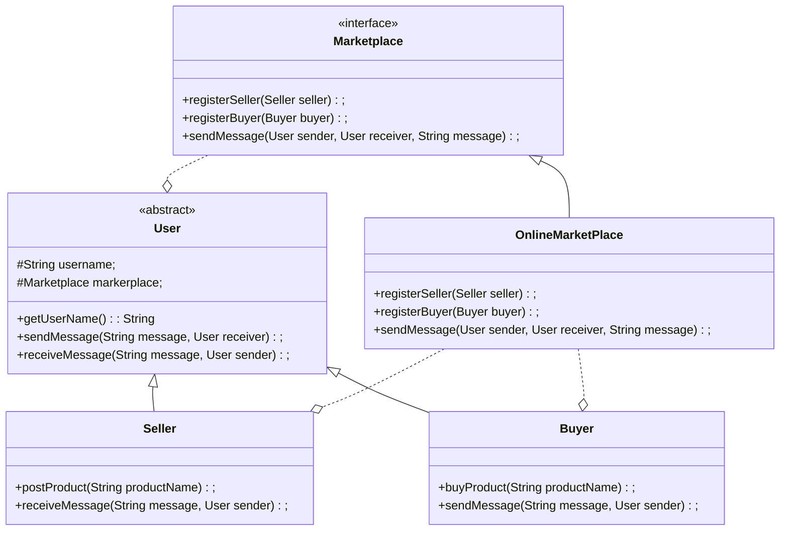

## Introduction

- Mediator is a behavioral design pattern that lets you reduce chaotic dependencies between objects.

- The pattern restricts direct communications between the objects and forces them to collaborate only via a mediator object.

::: info GOF Definition
It defines an object that encapsulates how a set of objects interact. The Mediator pattern promotes loose coupling by keeping objects from referring to each other explicitly, and it lets you vary their interaction independently.
:::

## Real-Life Example

- When an airplane needs to take off, a series of verifications take place. These kinds of verifications confirm that all components and parts (which are dependent on each other) are in perfect condition.

- You can also consider the case when the pilots of different airplanes (that are approaching or departing the terminal area) communicate with the airport towers. They do not explicitly communicate with other pilots in different airlines.They send their status to the controlling tower. These towers send signals to confirm who can take off (or land). These towers do not control the whole flight. They enforce constraints only in the terminal areas.

## Terms

- _Mediator:_ The Mediator component is responsible for defining the interface that facilitates communication between the participating objects(_Colleague Objects_).

- _ConcreteMediator_: It knows and maintains the list of Colleague objects. It implements the Mediator interface and coordinates the communication among the Colleague objects.

- _Colleague_: It defines the interface for communication with other colleagues.

- _Concrete Colleague(s)_: These are the specific implementations of the colleague. Each concrete colleague object knows how to send and receive messages using the Mediator interface. They are usually unaware of the existence of other concrete colleagues and interact solely with the Mediator.

## Example

- A simplified online marketplace where buyers and sellers communicate through a mediator.

- In this example, we have a `Marketplace` interface representing the mediator, `OnlineMarketplace`(other market place could RealEstateMarketplace) as the concrete mediator, and `Seller` and `Buyer` as the colleagues. The `OnlineMarketplace` keeps track of sellers and buyers and allows them to communicate with each other.

- The `Seller` can post a product, and the `Buyer` can purchase a product. When a seller posts a product or a buyer purchases a product, they send a message through the marketplace mediator. The mediator forwards the message to the intended receiver, and each user prints out the received message.

- When the program runs, the seller posts a product, and the buyer purchases the product.

### UML Diagram



### Implementation

:::: details Code

```java
// Mediator (Marketplace)
interface Marketplace {
    void registerSeller(Seller seller);
    void registerBuyer(Buyer buyer);
    void sendMessage(String message, User sender, User receiver);
}
```

```java
// Concrete Mediator (OnlineMarketplace)
class OnlineMarketplace implements Marketplace {
    private List<Seller> sellers;
    private List<Buyer> buyers;

    public OnlineMarketplace() {
        sellers = new ArrayList<>();
        buyers = new ArrayList<>();
    }

    public void registerSeller(Seller seller) {
        sellers.add(seller);
    }

    public void registerBuyer(Buyer buyer) {
        buyers.add(buyer);
    }

    public void sendMessage(String message, User sender, User receiver) {
        if (!sellers.contains(sender) && !buyers.contains(sender)) {
            System.out.println("Error: " + sender.getUsername() + " is not registered in the online marketplace.");
        } else if (!sellers.contains(receiver) && !buyers.contains(receiver)) {
            System.out.println("Error: " + receiver.getUsername() + " is not registered in the online marketplace.");
        } else {
            receiver.receiveMessage(message, sender);
        }
    }
}
```

```java
// Colleague (User)
abstract class User {
    protected String username;
    protected Marketplace marketplace;

    public User(String username, Marketplace marketplace) {
        this.username = username;
        this.marketplace = marketplace;
    }

    public String getUsername() {
        return username;
    }

    public void sendMessage(String message, User receiver) {
        marketplace.sendMessage(message, this, receiver);
    }

    public abstract void receiveMessage(String message, User sender);
}
```

```java
// Concrete Colleague (Seller)
class Seller extends User {
    public Seller(String username, Marketplace marketplace) {
        super(username, marketplace);
    }

    public void postProduct(String productName) {
        System.out.println(username + " posted a new product: " + productName);
        sendMessage("Product posted: " + productName, this);
    }

    public void receiveMessage(String message, User sender) {
        System.out.println(username + " received a message from " + sender.getUsername() + ": " + message);
    }
}
```

```java
// Concrete Colleague (Buyer)
class Buyer extends User {
    public Buyer(String username, Marketplace marketplace) {
        super(username, marketplace);
    }

    public void buyProduct(String productName) {
        System.out.println(username + " bought a product: " + productName);
        sendMessage("Product purchased: " + productName, this);
    }

    public void receiveMessage(String message, User sender) {
        System.out.println(username + " received a message from " + sender.getUsername() + ": " + message);
    }
}
```

```java
// Example Usage
public class Main {
    public static void main(String[] args) {
        Marketplace marketplace = new OnlineMarketplace();

        Seller seller = new Seller("John", marketplace);
        Buyer buyer = new Buyer("Alice", marketplace);
        Buyer nonRegisteredBuyer = new Buyer("Bob", marketplace);


        marketplace.registerSeller(seller);
        marketplace.registerBuyer(buyer);

        seller.postProduct("Smartphone");
        buyer.buyProduct("Smartphone");
        nonRegisteredBuyer.sendMessage("Hello", buyer);
    }
}
```

::::

<Replit user="sumanthtatipamula" repl="Mediator" file="Main.java"/>
