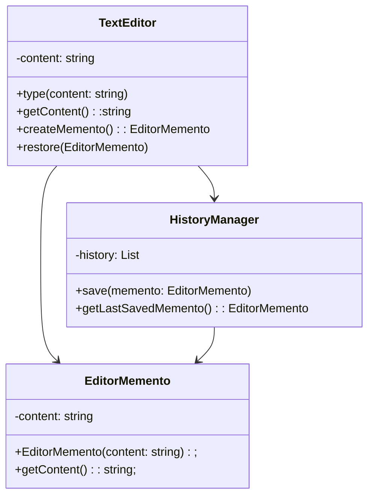

## Introduction

- Memento is a behavioral design pattern that lets you save and restore the previous state of an object without revealing the details of its implementation.

:::info GOF Definition
Without violating encapsulation, the Memento pattern captures and externalizes an object’s internal state so that the object can be restored to this state later.
:::

## Terms

- _Originator_: This is the object whose state needs to be saved and restored. It creates a memento object that encapsulates its internal state.

- _Memento:_ This is the object that stores the state of the Originator. It provides methods to retrieve the saved state and, in some cases, restrict access to the state.

- _Caretaker:_ This object is responsible for storing and managing the mementos. It requests a memento from the Originator, stores it, and later passes it back to the Originator for restoration.

## Implementation Guideliness

- Only the originator can store and retrieve necessary information from the memento. This memento is “opaque” to other objects.

- A caretaker class is the container of mementos. This class is used for the memento's safekeeping, but it never operates or examines the content of a memento. A caretaker can get the memento from the originator.

- A caretaker first asks the originator for a memento object. Then it can set a new state to it. Next, if it wants, it can save the memento. To reset an originator’s state, it passes back a memento object to the originator.

## Example

- The example allows the user to undo and redo their typing by storing and restoring previous states using the Memento pattern.

- In this example, the `TextEditor` class represents the Originator, which maintains the content of the text editor. The `EditorMemento` class serves as the Memento, encapsulating the state of the text editor. The `HistoryManager` class acts as the Caretaker, storing and managing the mementos.

- When the user types into the text editor, the content is updated. The `createMemento` method is called to create a memento object with the current content, which is then saved in the `HistoryManager`. Later, if the user wants to undo their changes, the last saved memento is retrieved from the `HistoryManager` and used to restore the state of the text editor.

### UML Diagram



### Implementation

:::: details Code

```java
// Memento
class EditorMemento {
    private String content;

    public EditorMemento(String content) {
        this.content = content;
    }

    public String getContent() {
        return content;
    }
}
```

```java
// Originator
class TextEditor {
    private String content;

    public TextEditor() {
        this.content = "";
    }

    public void type(String text) {
        content += text;
    }

    public String getContent() {
        return content;
    }

    public EditorMemento createMemento() {
        return new EditorMemento(content);
    }

    public void restore(EditorMemento memento) {
        content = memento.getContent();
    }
}
```

```java
// Caretaker
class HistoryManager {
    private List<EditorMemento> history;

    public HistoryManager() {
        history = new ArrayList<>();
    }

    public void save(EditorMemento memento) {
        history.add(memento);
    }

    public EditorMemento getLastSavedMemento() {
        if (history.isEmpty()) {
            return null;
        }
        return history.get(history.size() - 1);
    }
}
```

```java
// Usage
public class Main {
    public static void main(String[] args) {
        TextEditor editor = new TextEditor();
        HistoryManager history = new HistoryManager();

        editor.type("Hello");
        editor.type(" World");
        System.out.println(editor.getContent()); // Output: Hello World

        // Create a memento and save it in history
        history.save(editor.createMemento());

        editor.type("!");
        System.out.println(editor.getContent()); // Output: Hello World!

        // Restore the previous state from the memento
        EditorMemento lastMemento = history.getLastSavedMemento();
        if (lastMemento != null) {
            editor.restore(lastMemento);
        }
        System.out.println(editor.getContent()); // Output: Hello World
    }
}
```

::::

<Replit user="sumanthtatipamula" repl="Memento" file="Main.java"/>
