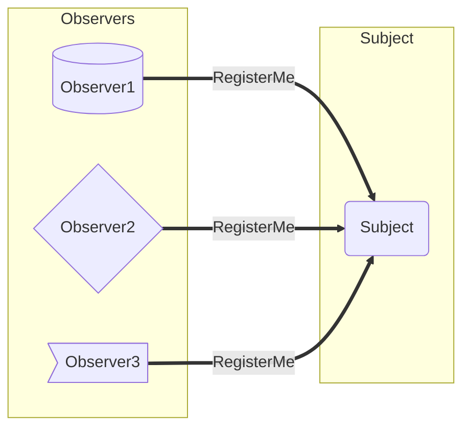
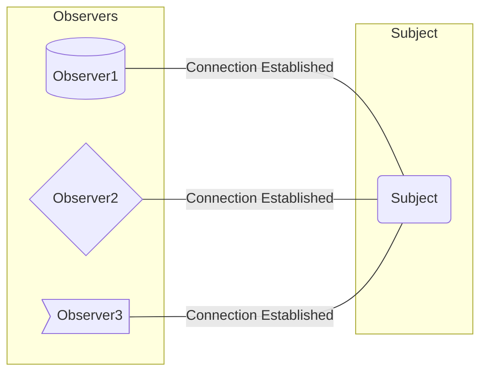
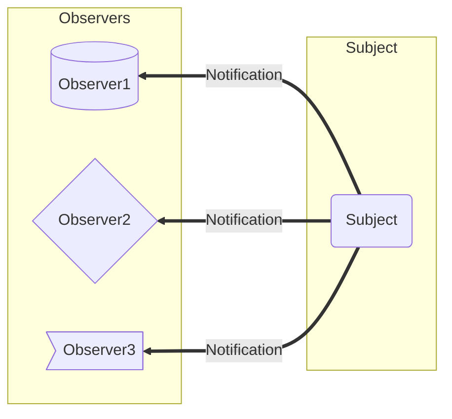
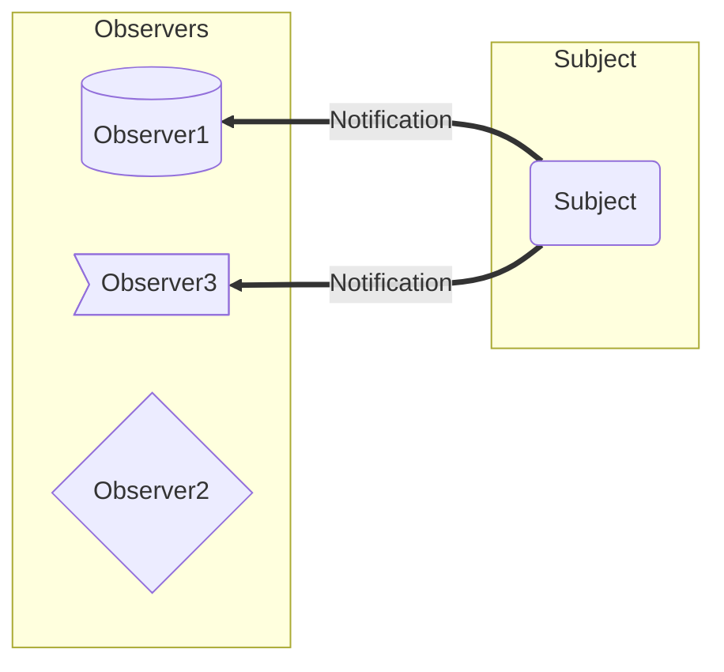
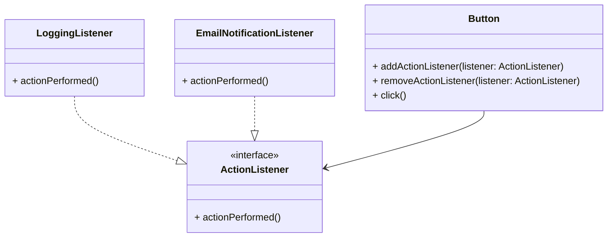

## Introduction

- Observer is a behavioral design pattern that lets you define a subscription mechanism to notify multiple objects about any events that happen to the object they’re observing.

::: info GOF Definition
It defines a one-to-many dependency between objects so that when one object changes state, all its dependents are notified and updated automatically.
:::

- This is model is also called Publisher - Subscriber Model.

- One can remove or add Subscribers in realtime.

- The subscribers need not be of same type.
  - _A company has both employees and customers who can purchase the company stocks. As a result, they like to get alerts when the stock price changes. In this case, both customers and employees are the observers and the company is the subject._

## Terms

- In this pattern there are two types of objects. One is `observer` and the other is the `subject`.

- _Observer:_ It is an object that needs to be informed when interesting stuff happens in another object.

- _Subject:_ The object about whom an observer is interested is called object.

## Pictorial Explanation

- _Step - 1:_ Three Observers request notification from a subject.

- _Step - 2:_ Subject can grant the requests; the connection is established.

- _Step - 3:_ Subject sends notifications to the registered users

- _Step - 4:_ Observer2 does not wants to get further notifications and requests to unregister themselves. So only Observer1 and Observer3 receives notifications

## Real World Examples

- Users subscribing to youtube channel.

- People following celebrities in Social Media

## Example

- Implementation of event listeners in graphical user interfaces (GUIs). Let's consider a simple scenario where you have a button in a GUI, and you want to perform some action when the button is clicked. Here's how you can use the Observer pattern to achieve this:

- In this example, the _Button_ class acts as the subject that maintains a list of _observers (listeners)_ implementing the _ActionListener_ interface. The Button class provides methods to add and remove listeners and a _click()_ method to simulate a button click event.

- The _LoggingListener_ and _EmailNotificationListener_ are concrete observer classes that implement the ActionListener interface. They define their respective actions to be performed when the button is clicked.

- In the _main()_ method, observers (listeners) are created and registered with the button using the _addActionListener()_ method. When the button's click() method is called, it notifies all the registered listeners by calling their _actionPerformed()_ method. In this case, both the logging and email notification actions will be performed.

### UML Diagram

<Replit user="sumanthtatipamula" repl="observer" file="Main.java"/>
