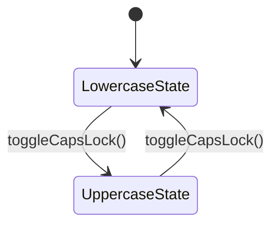

## Introduction

- State is a behavioral design pattern that lets an object alter its behavior when its internal state changes. It appears as if the object changed its class.

- This pattern is useful when an object's behavior depends on its internal state, and it needs to change its behavior dynamically at runtime without changing its class.

:::info GOF Definition
It allows an object to alter its behavior when its internal state changes. The object will appear to change its class.
:::

## Terms

- _Context:_ The context represents the object whose behavior changes based on its internal state. It maintains a reference to the current state object and delegates the behavior to that state object. The context can also provide methods for clients to change the state dynamically.

- _State:_ The state is an interface or an abstract class that defines the common methods that the concrete state classes must implement. These methods represent the different behaviors associated with each state.

- _Concrete State:_ Concrete state classes are the implementations of the state interface. Each concrete state class represents a specific state of the context object and provides its own implementation of the methods defined in the state interface.

## Real-Life Examples

- The functionalities of a traffic signal or television can be considered as examples of the State pattern. For example, you can change the channel if the TV is already in the switched-on mode. It will not respond to the channel change request if it is in the switched-off mode.

- Consider the scenario of a network connection, say a TCP connection. An object can be in various states. For example, a connection might already be established, a connection might be closed, or the object has already started listening through the connection. When this connection receives a request from other objects, it responds according to its present state.

## Example

- we have a `TextEditor` class that represents a simple text editor. It has two concrete state classes: `LowercaseState` and `UppercaseState`, which implement the `WritingState` interface. The `WritingState` interface defines methods for writing text and toggling caps lock.

- When the TextEditor receives a `type()` command, it delegates the writing behavior to the current state object. Initially, the editor starts in the `LowercaseState`, which converts the input text to lowercase. However, when the `toggleCapsLock()` method is called, the current state changes to `UppercaseState`, causing the text to be converted to uppercase. Subsequent calls to `type()` will behave differently based on the new state.

- This approach allows the TextEditor to exhibit different behaviors depending on its current state, without the need for conditional statements or explicit checks.

### UML Diagram



### Implementation

:::: details Code

```java
// State interface
interface WritingState {
    void write(String message);
    void toggleCapsLock(TextEditor textEditor);
}
```

```java
// Concrete state classes
class LowercaseState implements WritingState {
    public void write(String message) {
        System.out.println(message.toLowerCase());
    }

    public void toggleCapsLock(TextEditor textEditor) {
        System.out.println("Switching to UPPERCASE state.");
        textEditor.setState(new UppercaseState());
    }
}
```

```java
class UppercaseState implements WritingState {
    public void write(String message) {
        System.out.println(message.toUpperCase());
    }

    public void toggleCapsLock(TextEditor textEditor) {
        System.out.println("Switching to lowercase state.");
        textEditor.setState(new LowercaseState());
    }
}
```

```java
// Context class
class TextEditor {
    private WritingState currentState;

    public TextEditor() {
        currentState = new LowercaseState();
    }

    public void setState(WritingState state) {
        currentState = state;
    }

    public void type(String message) {
        currentState.write(message);
    }

    public void toggleCapsLock() {
        currentState.toggleCapsLock(this);
    }
}
```

```java
// Usage
public class Main {
    public static void main(String[] args) {
        TextEditor textEditor = new TextEditor();
        textEditor.type("Hello World");

        textEditor.toggleCapsLock();

        textEditor.type("Hello World");

        textEditor.toggleCapsLock();

        textEditor.type("Hello World");
    }
}
```

::::

<Replit user="sumanthtatipamula" repl="StatePattern" file="Main.java"/>
