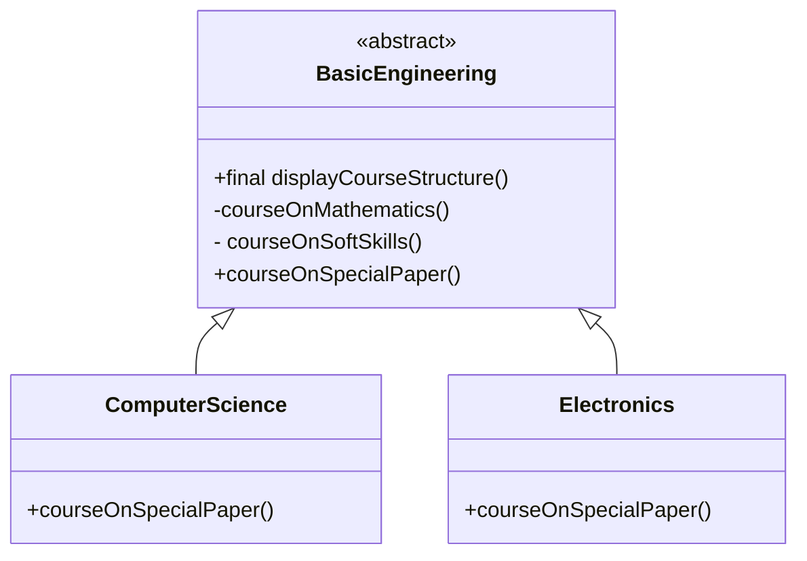

## Introduction

- **Template Method** is a behavioral design pattern that defines the skeleton of an algorithm in the superclass but lets subclasses override specific steps of the algorithm without changing its structure.

- This pattern follows the _"Don't call us, we'll call you"_ approach, where the superclass contains the high-level logic and delegates the implementation of specific steps to its subclasses.

:::info GOF Definition

It defines the skeleton of an algorithm in an operation, deferring some steps to subclasses. The Template Method pattern lets subclasses redefine certain steps of an algorithm without changing the algorithm’s structure.

:::

- The Template Method pattern makes sense when you want to avoid duplicate code in your application but allow subclasses to change specific details of the parent class workflow to bring varying behavior to the application. (However, you may not want to override the parent class methods entirely to make radical changes in the subclasses. In this way, the pattern differs from simple polymorphism.)

## How this pattern works

1. The superclass (also known as the _template class_) defines an algorithm as a series of steps, each represented by a method. It declares these methods as abstract or provides default implementations for them.

2. Some of the methods in the superclass are designed to be overridden by its subclasses, allowing them to provide their own implementations for specific steps. These methods are often referred to as _"hook methods."_

3. The superclass includes a _template method_ that orchestrates the execution of the algorithm by calling the individual steps in a predefined order. This template method relies on the abstract or overridden methods to perform the specific tasks.

4. Subclasses extend the template class and override the appropriate methods to provide custom behavior for the specific steps of the algorithm. They can choose to override all the hook methods or only the ones relevant to their needs.

5. Clients work with the concrete subclasses, using the template method defined in the superclass. They don't need to be aware of the specific implementations of each step; they simply invoke the template method, which takes care of executing the algorithm in the correct order.

## Java Builtin Example

- The removeAll() method of java.util.AbstractSet can be considered as an example of a Template Method pattern.

## Example

### UML Diagram



### Implementation

:::: details Code

```java
abstract class BasicEngineering {
     // The "Template Method"
     // Making the method final to prevent overriding.
     public final void displayCourseStructure() {
          /*
           * The course needs to be completed
           * in the following sequence:
           * 1.Mathematics
           * 2.Soft skills
           * 3.Subclass-specific paper
           */
          // Common Papers:
          courseOnMathematics();//Step-1
          courseOnSoftSkills(); //Step-2
          // Course-specific Paper:
          courseOnSpecialPaper();//Step-3
     }
     private void courseOnMathematics() {
          System.out.println("1. Mathematics");
     }
     private void courseOnSoftSkills() {
          System.out.println("2. Soft Skills");
     }
     /*
      * The following method will vary.
      * It will be overridden by the
      * derived classes.
      */
     // Hook Method
     public abstract void courseOnSpecialPaper();
}
```

```java
class ComputerScience extends BasicEngineering {
     @Override
     public void courseOnSpecialPaper() {
          System.out.println("3. Object-Oriented Programming");
     }
}
```

```java
class Electronics extends BasicEngineering {
     @Override
     public void courseOnSpecialPaper() {
          System.out.println("3. Digital Logic and Circuit Theory");
     }
}
```

```java
class Client {
     public static void main(String[] args) {
          System.out.println("***Template Method Pattern Demonstration.***\n");
          BasicEngineering preferrredCourse = new
                              ComputerScience();
          System.out.println("Computer Science course structure:");
          preferrredCourse.displayCourseStructure();
          System.out.println();
          preferrredCourse = new Electronics();
          System.out.println("Electronics course structure:");
          preferrredCourse.displayCourseStructure();
     }
}
```

::::

<Replit user="sumanthtatipamula" repl="Template" file="Main.java"/>

## Advantages

- You can control the flow of the algorithms. Clients cannot change this.
- Common operations are in a centralized location. For example, in an abstract class, the subclasses can redefine only the varying parts so that you can avoid redundant code.

## Difference Between Polymorphism and Template Method

| Category             | Template Method                                                                                                    | Polymorphism                                                                                                                                        |
| -------------------- | ------------------------------------------------------------------------------------------------------------------ | --------------------------------------------------------------------------------------------------------------------------------------------------- |
| Purpose              | Defines the structure of an algorithm and allows subclasses to provide specific implementations for certain steps. | Enables objects of different classes to be treated as objects of a common superclass or interface, allowing different behavior for the same method. |
| Design Level         | Design pattern that provides a higher-level structure for organizing algorithms.                                   | Fundamental concept of object-oriented programming that focuses on object behavior.                                                                 |
| Level of Abstraction | Higher level                                                                                                       | Lower level                                                                                                                                         |
| Implementation       | Abstract or virtual methods                                                                                        | Inheritance or interfaces                                                                                                                           |
