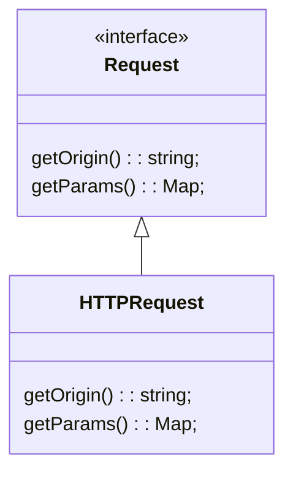
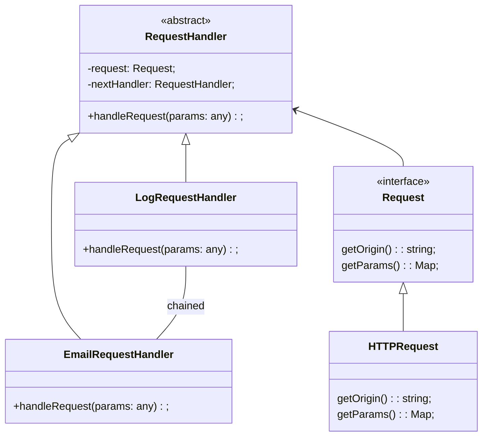

## Introduction

- Chain of Responsibility is a behavioral design pattern that lets you pass requests along a chain of handlers. Upon receiving a request, each handler decides either to process the request or to pass it to the next handler in the chain.

::: info GOF Definition
It avoids coupling the sender of a request to its receiver by giving more than one object a chance to handle the request. It chains the receiving objects and passes the request along the chain until an object handles it.
:::

## Implementation

- Declare the handler interface and describe the signature of a method for handling requests.

- To eliminate duplicate boilerplate code in concrete handlers, it might be worth creating an abstract base handler class, derived from the handler interface.

- One by one create concrete handler subclasses and implement their handling methods. Each handler should make two decisions when receiving a request:

  - Whether it’ll process the request.
  - Whether it’ll pass the request along the chain.

- The client may trigger any handler in the chain, not just the first one. The request will be passed along the chain until some handler refuses to pass it further or until it reaches the end of the chain.

## Example

- We have a chain of responsibility to process request. The chain consists of two concrete handlers: `LogRequestHandler` and `EmailRequestHandler`. Each handler is responsible for processing requests based on different criteria.
- The `Request` is an interface which is implemented by concrete class `HTTPRequest`.

### UML Class Diagram

**Step - 1:** Creation of Request Object

**Step - 2:** Attaching the chain of handles that will process the request.

<Replit user="samsandy111999" repl="chainofresponsibility" file="index.ts"/>
