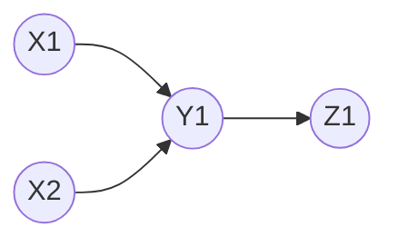
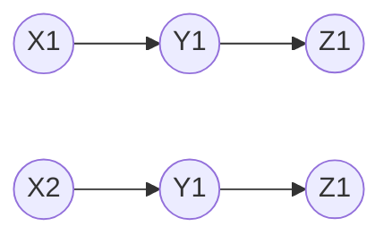

## Introduction

::: info GOF Definition

- It specifies the kinds of objects to create using a prototypical instance and creates new objects by copying this prototype.

:::

- This pattern provides an alternative method for instantiating new objects by copying or cloning an instance of an existing object. Thus, you can avoid the expense of creating a new instance using this concept.
- Why it is significant ?
  - The construction of a new instance from scratch is a time-consuming operation.
  - You may need some resources to make an instance, but these resources may not be easily available.
  - We need to hide the complexity of creating the new instances from client.

### Computer World Example

- In Java programming, the clone() method of the Object class is an example of the Prototype pattern. This method can create and return a copy of an existing object. In this context, your class needs to be Cloneable.

::: info Cloneable Interface

- A class implements the `Cloneable` interface to indicate to the Object.clone() method that it is legal for that method to make a field-for-field copy of instances of that class.
- Invoking Object's clone method on an instance that does not implement the `Cloneable` interface results in the exception `CloneNotSupportedException` being thrown.
- By convention, classes that implement this interface should override `Object.clone` (which is protected) with a public method.
- Cloneable Interface is empty and doesn't contain any members and those interfaces is called tagging interface.

:::

### Copying Mechanisms

- The idea of using copy is to create a new object of the same type without knowing the exact type of the object we are invoking.

**Shallow Copy:**

- This mechanism creates a new object that references the same data as the original object. Changes made to the copied object can affect the original object and vice versa.
- It is preferred if an object has only primitive fields.
- It is fast and less expensive.

**Deep Copy:**

- In contrast to shallow copy, deep copy creates a new object and recursively copies all the data within the original object. Changes made to the copied object do not affect the original object.
- It is preferred if an object has references to other objects as fields.

**Serialization:**

- Serialization is the process of converting an object into a serialized format (such as JSON or binary) that can be stored or transmitted. Deserialization reverses the process, recreating an object from the serialized data.

**Prototype:**

- The prototype mechanism involves creating new objects by cloning or copying an existing object, known as the prototype. The new objects inherit the properties and behaviors of the prototype.

### Pictorial Representation of Shallow and Deep copy

- Object X1 has a reference to another object, Y1. Again, object Y1 has a reference to object Z1.
- Object X2 is clone version of X1

**Shallow Copy:**

- Change in Y1 in X2 does effect Y1 in X1, as both points to same reference of Y1

**Deep Copy:**

- Object X2 has its own version of Y1 and again Y1 has its own version of Z1. So change in Y1 in X2 doesn't effect Y1 in X1

<Replit user="samsandy111999" repl="PrototypePattern-1" file="Main.java"/>
