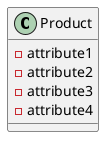
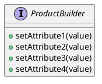
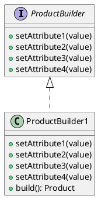

## Introduction

- Builder is a creational design pattern that you can use to deal with the step-by-step construction of objects that can have multiple future representations.
- Quite often you create objects that take more than two or three parameters and many of those parameters are not known ahead of time. They are required, though, to initialize the object with the right state.

## When do we use builder pattern

- **A common set of steps to create an object**: You want to provide an interface with common steps to create an object that is not tied to any implementation. Those steps should be independent, and should always return a usable object when requested. i.e to build complex object with mandatory and optional attributes.

- **Multiple Representations**: You can have multiple representations of an object, maybe as variants or as a sub-class type. If you do not anticipate or require to have more than one representation in the future, then this pattern would look over-engineered and unnecessary.

## UML Class Diagram

- **Step - 1**: First, you have a Product class that can have multiple parameters



- The Product class can have its own setter or getter methods but it's important to note that it may contain multiple optional parameters.

- **Step - 2**: Then you need the interface that breaks up the steps of creating this Product class into a reusable format



- **Step - 3**: Once you have those two pieces, you will also need a concrete Builder



- The key observation over here is the build() method. When called from this class it will return a Product type with the attributes we set previously.

## Implementations

### Classic Implementation

- Product

```typescript
class Website {
	constructor(
		public name?: string,

		public host?: string,

		public port?: number,

		public isPremium?: boolean
	) {}
}
```

- interface

```typescript
interface WebsiteBuilder {
	setName(name: string): WebsiteBuilder;

	setHost(host: string): WebsiteBuilder;

	setPort(port: number): WebsiteBuilder;
	setIsPremium(isPremium: boolean): WebsiteBuilder;

	build(): Website;
}
```

- Concrete Builder

```typescript
class PremiumWebsiteBuilder implements WebsiteBuilder {
	constructor(private website: Website) {
		this.clear();
	}

	setName(name: string): WebsiteBuilder {
		this.website.name = name;

		return this;
	}

	setHost(host: string): WebsiteBuilder {
		this.website.host = host;

		return this;
	}

	setPort(port: number): WebsiteBuilder {
		this.website.port = port;

		return this;
	}
	setIsPremium(): WebsiteBuilder {
		this.website.isPremium = true;

		return this;
	}

	build(): Website {
		const website = this.website;

		this.clear();

		return website;
	}

	clear(): void {
		this.website = new Website();

		this.website.isPremium = true;
	}
}
```

- Creating Object

```typescript
const wb = new PremiumWebsiteBuilder();

wb.setName('example').setHost('localhost').setPort(3000);

const website = wb.build();
```

### Modern Implementation

- Some modern implementations of this pattern, using TypeScript, try to offer a reusable implementation part that uses ES6 Proxies and Object.assign. This is mainly to avoid reiterating and manually providing setter methods for all the Product properties.

```typescript
export type Builder<T> = {
	[k in keyof T]-?: (arg: T[k]) => Builder<T>;
} & {
	build(): T;
};

export function ModelBuilder<T>(): Builder<T> {
	const built: Record<string, unknown> = {};

	const builder = new Proxy(
		{},

		{
			get(target, prop) {
				if ('build' === prop) {
					return () => built;
				}

				return (x: unknown): unknown => {
					built[prop.toString()] = x;

					return builder;
				};
			},
		}
	);

	return builder as Builder<T>;
}

interface User {
	id: number;

	name: string;

	email: string;
}

const user = ModelBuilder<User>()
	.id(1)

	.name('Theo')

	.email('theo@example.com')

	.build();

console.debug(user);
```

- In the preceding code block, we highlighted the use of the Proxy class that delegates the method calls and perform assignments. If the message sent is build, then subsequently, it returns the object so far, otherwise, it assigns the property to the object. This works for simple assignments but if you want to have something more advanced, such as adding or removing items on a list, then you would be back to square one.
