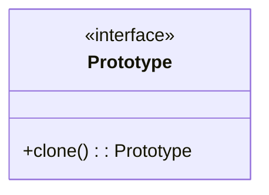
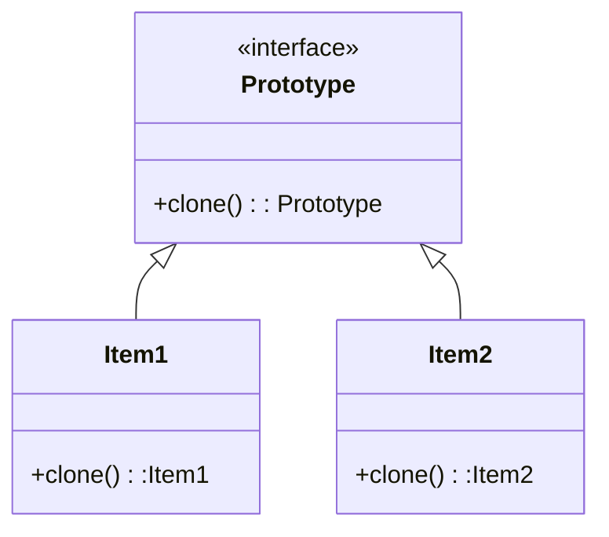
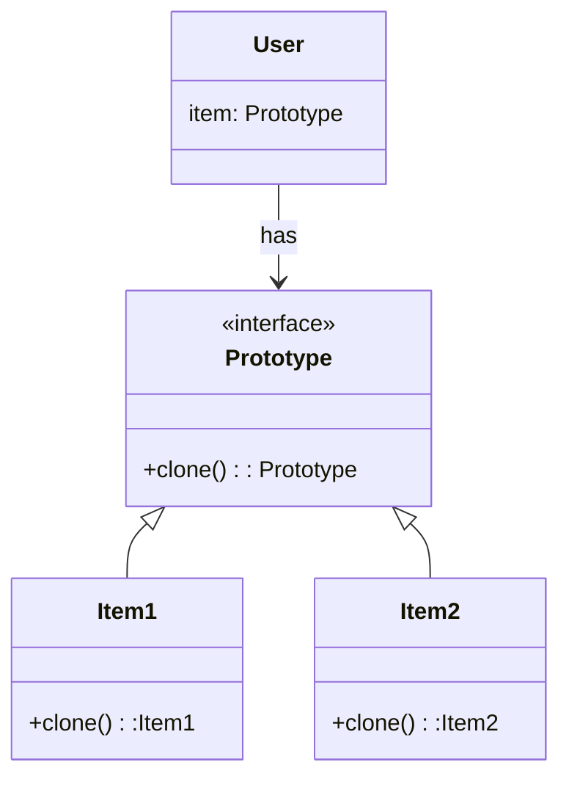

## Introduction

::: info GOF Definition

- It specifies the kinds of objects to create using a prototypical instance and creates new objects by copying this prototype.

:::

- A Prototype is a kind of object that takes its initial state and properties out of existing objects. The main idea is to avoid having to manually create an object and assign properties to it from another object.
- You construct objects that adhere to the `Prototype` interface, which has a single method, `clone()`.

### When do we use the prototype pattern

- **You have a bunch of objects and want to clone them at runtime:** You have already created some objects and hold references to them at runtime, and you want to quickly get identical copies without going back to the Factory method and assigning properties again.
- **You want to avoid using the new operator directly:** In this case, you want to call the clone method to get a copy. You want to avoid using the new operator as it may incur additional overhead.

## UML Class Diagram.

- **Step - 1:** Create an Prototype Interface, which contains method clone()

- **Step - 2:** We create Items by implementing the interface

- **Step-3:** User will be user Prototype interface and assign Items as when required

## Example

- Suppose we are planning to build to a war related game. So there are several characters that need to be made. few of them could be repetitive for eg: soldiers. so Instead of creating new solider each time we clone the existing soldier and modify properties accordingly if needed.

<Replit user="samsandy111999" repl="PrototypePattern" file="index.ts" />
