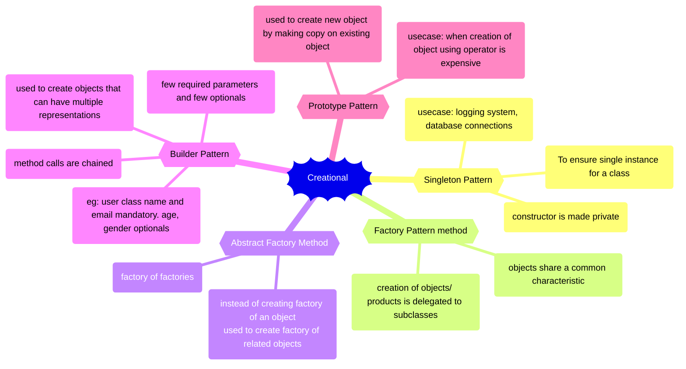

Creational design patterns are a set of design patterns in software development that deal with object creation mechanisms, trying to create objects in a manner suitable for a given situation. These patterns provide ways to create objects while decoupling the client code from the specific classes or objects that are being instantiated. They aim to provide flexibility and reusability in object creation.

There are 6 creational design patterns:

1. Singleton Pattern
2. Factory Pattern method.
3. Abstract Factory Method.
4. Builder Pattern
5. Prototype Pattern
6. Object pool

