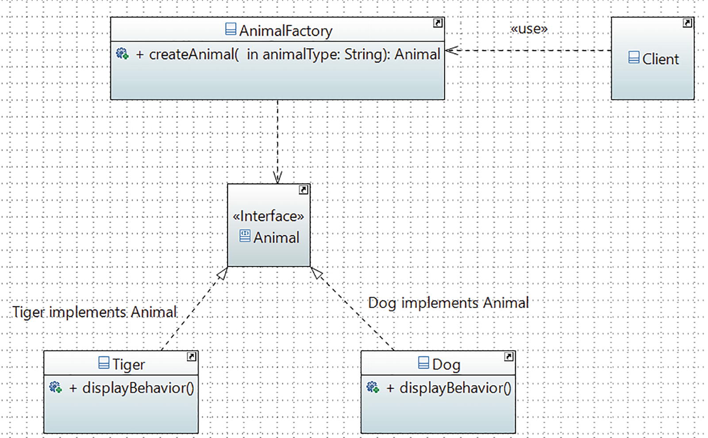
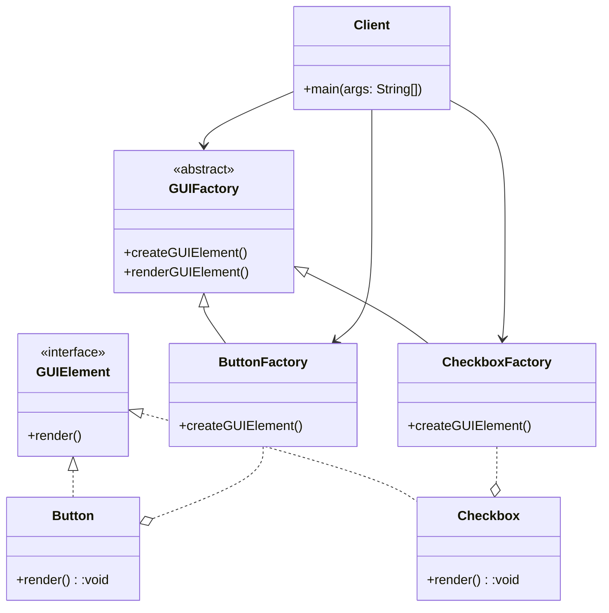
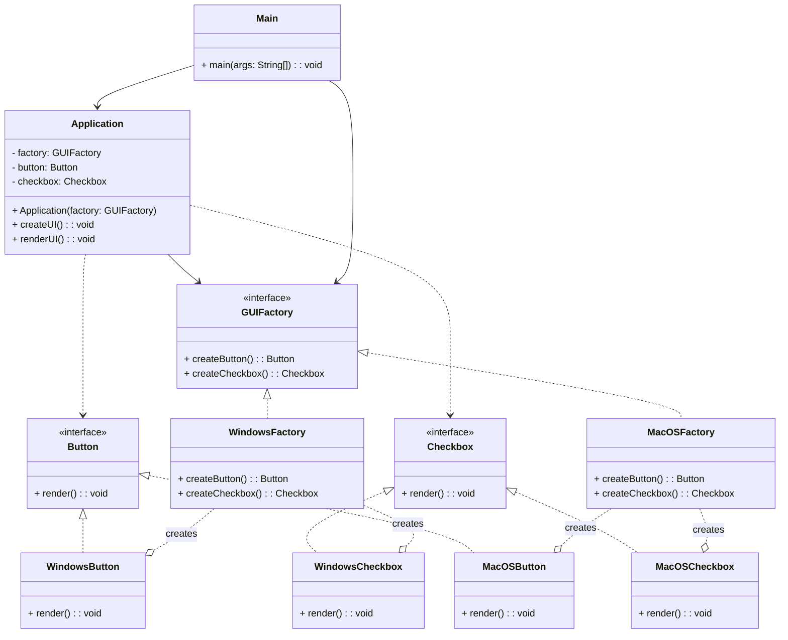

## Simple Factory Pattern

### Introduction

- **Factory**: Mass production of similar kind of products.
- In object oriented programming, a factory is an object that can create other objects.
- It creates an object without exposing the instantiation logic to the client.
- A factory can be invoked in many different ways, but most often it uses a method that can return objects with varying prototypes.

### Real World example in JDK

- The static method `getInstance()` of the `java.text.NumberFormat` class is an example of this category.

### Instead of delegating the object's creation through the Simple Factory Pattern, we could directly create the objects with new operator ?

- No
- One of the key object-oriented design principles is to separate the parts of your code that are most likely to change from the rest.
- How objects are created is hidden from client code. This kind of abstraction promotes security.

### Disadvantages

1. **Lack of flexibility**: The Simple Factory pattern can be rigid and inflexible when new types of objects need to be added.
2. **Violation of Open-Closed Principle** : Since the factory class is responsible for creating all the objects, any changes or addition to the object hierarchy require modifications to the factory class, violation open-closed principle.
3. **Violation of Single Responsibility Principle**: The factory class takes on the responsibility of creating objects, which can lead to a violation of the Single Responsibility Principle. Ideally, a class should have only one reason to change, but the factory class may need to change for multiple reasons, such as adding new object types or modifying object creation logic.

### Implementation

#### UML Representation



```java
// Animal.java
interface Animal{
    void displayBehavior();
}
// Dog.java
class Dog implements Animal{
   public Dog(){
    System.out.println("\nA dog is created.");
   }
   public void displayBehavior(){
    System.out.println("It says: Bow-Wow.");
    System.out.println ("It prefers barking.");
   }
}
// Tiger.java
class Tiger implements Animal{
    public Tiger()
    {
         System.out.println("\nA tiger is created.");
    }
    public void displayBehavior(){
         System.out.println("Tiger says: Halum.");
         System.out.println("It loves to roam in a jungle.");
    }
}
// AnimalFactory.java
class AnimalFactory {
 public Animal createAnimal(String animalType){
   Animal animal;
   if (animalType.equals("dog")){
    animal = new Dog();
   }
   else if (animalType.equals("tiger")){
    animal = new Tiger();
   }
   else{
    System.out.println("You can create either a 'dog' or a 'tiger'. ");
    throw new IllegalArgumentException("Unknown animal cannot be instantiated.");
    }
    return animal;
   }
}
// Client.java
class Client {
     public static void main(String[] args) {
        System.out.println("*** Simple Factory
                             Demonstration.***");
        AnimalFactory factory = new AnimalFactory();
        Animal animal = factory.createAnimal("dog");
        animal.displayBehavior();
        animal = factory.createAnimal("tiger");
        animal.displayBehavior();
     }
}
```

## Factory Method Pattern

### Introduction

- It defines an interface for creating an object, but lets subclasses decide which class to instantiate. The Factory Method pattern lets a class defer instantiation to subclasses.
- We start with an abstract creator class that defined the basic structure of an application, and the subclasses take the responsibility of doing the actual instantiation process.

### Real World Example

- In database programming, you may need to support different database users. For example, one user may use SQL Server and the other may opt for Oracle. So, when you need to insert data into your database, first you need to create a connection object, such as SqlServerConnection or OracleConnection, and only then can you proceed.
- If you put the code into an if-else block (or switch statements), you may need to repeat lots of similar code, which isn’t easily maintainable. Also, whenever you start supporting a new type of connection, you need to reopen your code and make modifications. This type of problem can be resolved using the Factory Method pattern.

### Example

```java
// GUIElement interface
public interface GUIElement {
    void render();
}

// Button class implementing GUIElement
public class Button implements GUIElement {
    @Override
    public void render() {
        System.out.println("Rendered a button.");
    }
}

// Checkbox class implementing GUIElement
public class Checkbox implements GUIElement {
    @Override
    public void render() {
        System.out.println("Rendered a checkbox.");
    }
}

// GUIFactory abstract class
public abstract class GUIFactory {
    public abstract GUIElement createGUIElement();

    public void renderGUIElement() {
        GUIElement element = createGUIElement();
        element.render();
    }
}

// Concrete factory for creating Button
public class ButtonFactory extends GUIFactory {
    @Override
    public GUIElement createGUIElement() {
        return new Button();
    }
}

// Concrete factory for creating Checkbox
public class CheckboxFactory extends GUIFactory {
    @Override
    public GUIElement createGUIElement() {
        return new Checkbox();
    }
}

// Client code
public class Client {
    public static void main(String[] args) {
        GUIFactory buttonFactory = new ButtonFactory();
        buttonFactory.renderGUIElement();

        GUIFactory checkboxFactory = new CheckboxFactory();
        checkboxFactory.renderGUIElement();
    }
}

```



## Abstract Factory Method

### Structure

Here's the structure of the Abstract Factory pattern:

- **AbstractFactory**: Declares an interface for creating a family of related objects.
- **ConcreteFactory**: Implements the AbstractFactory interface to create specific products.
- **AbstractProduct**: Declares an interface for a type of product.
- **ConcreteProduct**: Represents a specific product that implements the AbstractProduct interface.
- **Client**: Uses the AbstractFactory and AbstractProduct interfaces to create and work with products.

### Example

The primary purpose of the Abstract Factory is to create an entire family the objects that aren’t in the same hierarchy. Creating UI elements for different styles of devices that would stylistically fit is an good example of this pattern.

```java
// AbstractProductA
interface Button {
    void render();
}

// ConcreteProductA1
class WindowsButton implements Button {
    public void render() {
        System.out.println("Rendering a Windows button.");
    }
}

// ConcreteProductA2
class MacOSButton implements Button {
    public void render() {
        System.out.println("Rendering a macOS button.");
    }
}

// AbstractProductB
interface Checkbox {
    void render();
}

// ConcreteProductB1
class WindowsCheckbox implements Checkbox {
    public void render() {
        System.out.println("Rendering a Windows checkbox.");
    }
}

// ConcreteProductB2
class MacOSCheckbox implements Checkbox {
    public void render() {
        System.out.println("Rendering a macOS checkbox.");
    }
}

// AbstractFactory
interface GUIFactory {
    Button createButton();
    Checkbox createCheckbox();
}

// ConcreteFactoryA
class WindowsFactory implements GUIFactory {
    public Button createButton() {
        return new WindowsButton();
    }

    public Checkbox createCheckbox() {
        return new WindowsCheckbox();
    }
}

// ConcreteFactoryB
class MacOSFactory implements GUIFactory {
    public Button createButton() {
        return new MacOSButton();
    }

    public Checkbox createCheckbox() {
        return new MacOSCheckbox();
    }
}

// Client
class Application {
    private GUIFactory factory;
    private Button button;
    private Checkbox checkbox;

    public Application(GUIFactory factory) {
        this.factory = factory;
    }

    public void createUI() {
        button = factory.createButton();
        checkbox = factory.createCheckbox();
    }

    public void renderUI() {
        button.render();
        checkbox.render();
    }
}

// Usage
public class Main {
    public static void main(String[] args) {
        GUIFactory windowsFactory = new WindowsFactory();
        Application windowsApp = new Application(windowsFactory);
        windowsApp.createUI();
        windowsApp.renderUI();

        GUIFactory macOSFactory = new MacOSFactory();
        Application macOSApp = new Application(macOSFactory);
        macOSApp.createUI();
        macOSApp.renderUI();
    }
}

```



#### Arrows Meanings

- `-->`: Represents an association relationship. It indicates that one class/interface is associated with another class/interface. For example, Application class has an association with GUIFactory interface, indicating that Application depends on GUIFactory to create UI elements.

- `..o`: Represents an aggregation relationship. It indicates that one class/interface has a whole-part relationship with another class/interface. For example, Application class has an aggregation relationship with Button and Checkbox interfaces, indicating that Application has buttons and checkboxes as its components.

- `<|..`: Represents a inheritance relationship. It indicates that one class/interface is a specialized version of another class/interface. For example, Button and Checkbox interfaces are specialized by WindowsButton, MacOSButton, WindowsCheckbox, and MacOSCheckbox classes, indicating that these classes implement the interfaces.

## Difference between Factory Method Pattern and Abstract Factory Pattern

| Aspect         | Factory Method Pattern                                                                | Abstract Factory Pattern                                                                                        |
| -------------- | ------------------------------------------------------------------------------------- | --------------------------------------------------------------------------------------------------------------- |
| Intent         | Creates a single object with subclasses determining the concrete class to instantiate | Creates families of related objects without specifying concrete classes                                         |
| Structure      | Creator class, Factory method, and Product hierarchy                                  | Abstract Factory, Concrete Factories, and Product hierarchy                                                     |
| Implementation | Subclasses override the factory method to create specific instances                   | Concrete Factories create related objects                                                                       |
| Use case       | When there is a single abstract type and subclasses determine the concrete type       | When there are multiple families of related objects and you want to create objects from one family consistently |
