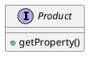
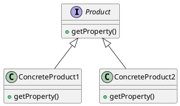
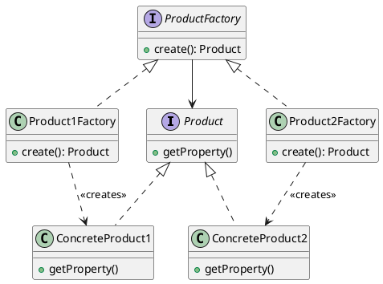

## Factory Method Pattern

### Introduction

- This pattern deals with the creation of objects and particularly with delegating the creation of objects using subclasses.
- The objects you want to create usually share a common characteristic; they are similar in nature or in type or they are part of a hierarchy.
- Instead of considering using the `new` operator to create those objects manually, we define a Factory method called create that accepts either an interface or a type variable that describes what you want to create. This Factory method will abstract all the inner details of creating the right object and return it for you.

### When do we use the Factory Method ?

- When you have a list of various objects with a parent-child relationship, such as Element, HTMLElement, HTMLSpanElement, and so on, it is not ideal to create them typically using the new operator.
- Sometimes, instead of passing a description and letting the factory create the object in question, you want to have a specialized factory for constructing this object. This way, you can use an interface for this factory and pass relevant Factory Method objects. At runtime, when you implement this interface, using polymorphism, it will call the right Factory method.

### UML Class Diagrams

Step - 1 : We define the `Product` interface that describes the public methods of the concrete products.



Step - 2: We create concrete products by implementing the interface



Step - 3: On the other side, we also have a pair of Factory interfaces and concrete factory objects that represent the creation of new Product instance:



## Abstract Factory Pattern

### Introduction

- The Abstract Factory is a creational design pattern that lets you create an abstract representation of factories without specifying concrete classes. You can think of this pattern as a factory of factories. You use it to create a common shape of factory objects and then when you want to use them in practice, you implement specific methods to create those objects.

### When do we use Abstract Factory ?

- **Need a factory of related objects**: Instead of creating a factory of an object, you need to create a factory of related objects. Those objects may or may not be part of an aggregation but they have some sort of cohesive relationship. Maybe they are part of a User Interface (UI). In a UI, you can have several types of elements including buttons, windows, or text fields, but each with different representations. Instead of creating factories for those elements, you define an Abstract Factory interface that captures the creation of those individual elements.

- **Clients will interact with a factory interface**: The clients that try to use the Abstract Factory will only need to supply a type of factory they want to use. Then they will get an instance of that interface and can call the respective factory-related methods without knowing the details of each factory and how they create those objects. This allows the client to change the factory to use a different one at runtime, making it easier to quickly swap views.

### UML Class Diagram

- Step - 1: First you want to describe the interface of the factory that create hierarchy of objects.

```puml
interface AbstractFactory{
    createProductA(): ProductA
    createProductB(): ProductB
    createProductC(): ProductC
}
```

- Step - 2: Each method will create a different product type but ideally, all three product types should have some sort of relationship or hierarchical commonality. The products must also conform to an interface declaration.

```puml
interface ProductA{

}
interface ProductB{

}
interface ProductC{

}
```

- Step - 3: If you want to provide concrete implementations for AbstractFactory, you will need to implement all those interfaces.

```puml
interface AbstractFactory{
    +createProductA(): ProductA
    +createProductB(): ProductB
    +createProductC(): ProductC
}
interface ProductA{

}
interface ProductB{

}
interface ProductC{

}
class ConcreteProductA{

}
class ConcreteProductB{

}
class ConcreteProductC{

}
class ConcreteFactory{
    +createProductA(): ProductA
    +createProductB(): ProductB
    +createProductC(): ProductC
}
ProductA <|.. ConcreteProductA
ProductB <|.. ConcreteProductB
ProductC <|.. ConcreteProductC
AbstractFactory <|.. ConcreteFactory
```

### Example

```typescript
interface WebsitePageFactory {
	createHeader(): Header;

	createContent(): Content;

	createFooter(): Footer;
}

interface Header {
	content: string;
}

interface Content {
	content: string;
}

interface Footer {
	content: string;
}
class HTMLWebsitePageFactory implements WebsitePageFactory {
	createHeader(text: string): HTMLHeader {
		return new HTMLHeader(text);
	}

	createContent(text: string): HTMLContent {
		return new HTMLContent(text);
	}

	createFooter(text: string): HTMLFooter {
		return new HTMLFooter(text);
	}
}

class HTMLHeader implements Header {
	content: string;

	constructor(text: string) {
		this.content = '<head>${text}</head>';
	}
}

class HTMLContent implements Content {
	content: string;

	constructor(text: string) {
		this.content = '<main>${text}</main>';
	}
}

class HTMLFooter implements Footer {
	content: string;

	constructor(text: string) {
		this.content = '<footer>${text}</footer>';
	}
}
```
