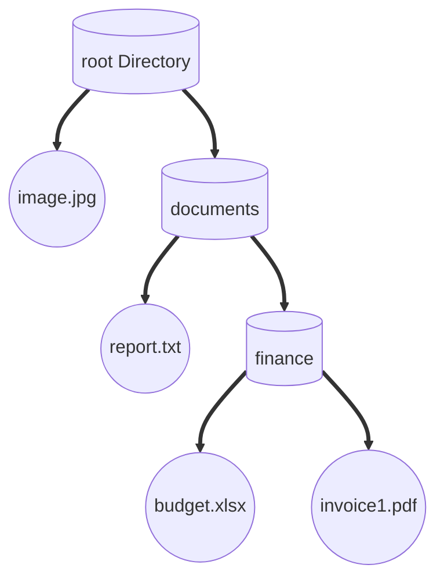
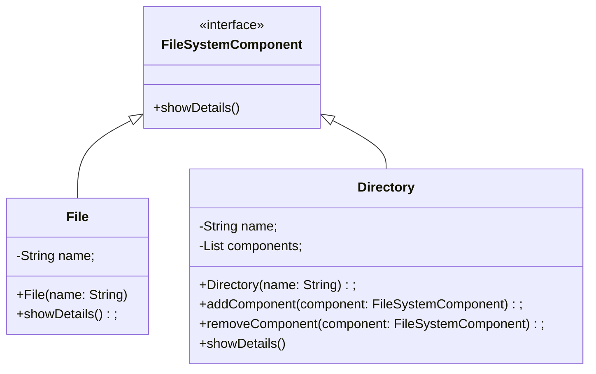

## Introduction

- Composite is a structural design pattern that lets you compose objects into tree structures and then work with these structures as if they were individual objects.

::: info GOF Definition
It composes objects into tree structures to represent part-whole hierarchies. The Composite pattern lets clients treat individual objects and compositions of objects uniformly.
:::

- The composite pattern is useful in a similar situation where you want to treat both the individual parts and the combination of the parts in the same way so that you can process them uniformly.

## Real-Life Example

- Apart from the previous example, you can also think of an organization that consists of many departments. In general, an organization has many employees. Some of these employees are grouped to form a department and those departments can be further grouped to build the final structure of the organization.

## Terms

- **Component:** The Component is an interface or an abstract class that declares the common methods for all objects in the composition. It defines the interface for both leaf objects and composite objects. This component can represent the "part" in the part-whole hierarchy.

- **Composite:** The Composite represents the container that can hold other components, including both individual objects (leaves) and other composite objects. It acts as a container for its child components. The composite object can have one or more child components. This component represents the "whole" in the part-whole hierarchy.

## When to use

- **To represent a hierarchical model as a tree structure without exposing the details:** Composite makes sense when you want to represent a whole-part relationship between objects. what we mean by whole-part is that on the one hand, there is a container object that uses a has-a relationship to the child objects, and on the other hand, we have child objects that use an is-a relationship with each other.

- **Reclusively iterate and perform polymorphic calls to a tree model:** With the tree structure of Composite, you want to iterate over all of the elements and perform polymorphic method calls based on the type of the Composite element. The results would be either returned as a new type or sent to a different target. This process simplifies the operations that handle each of the objects on the hierarchy.

## Example

- Let's consider an example of a file system hierarchy. In this example, we'll have directories (composites) that can contain both files (leaves) and subdirectories (composites). The Composite pattern will be used to treat directories and files uniformly.

### Pictorial Representation

- Circle represents leaf
- Cylindrical shape represent composite



### UML Diagram



#### Implementation

:::: details Code

```java
// Component
interface FileSystemComponent {
    void showDetails();
}
```

```java
// Leaf
class File implements FileSystemComponent {
    private String name;

    public File(String name) {
        this.name = name;
    }

    public void showDetails() {
        System.out.println("File: " + name);
    }
}
```

```java
// Composite
class Directory implements FileSystemComponent {
    private String name;
    private List<FileSystemComponent> components;

    public Directory(String name) {
        this.name = name;
        components = new ArrayList<>();
    }

    public void addComponent(FileSystemComponent component) {
        components.add(component);
    }

    public void removeComponent(FileSystemComponent component) {
        components.remove(component);
    }

    public void showDetails() {
        System.out.println("Directory: " + name);
        for (FileSystemComponent component : components) {
            component.showDetails();
        }
    }
}
```

```java
// Usage
public class CompositeExample {
    public static void main(String[] args) {
        FileSystemComponent file1 = new File("document.txt");
        FileSystemComponent file2 = new File("image.jpg");
        FileSystemComponent subdirectory = new Directory("documents");
        FileSystemComponent directory = new Directory("root");

        ((Directory) subdirectory).addComponent(file1);
        ((Directory) directory).addComponent(file2);
        ((Directory) directory).addComponent(subdirectory);

        directory.showDetails();
    }
}
```

::::

<Replit user="sumanthtatipamula" repl="CompositePattern" file="Main.java"/>
