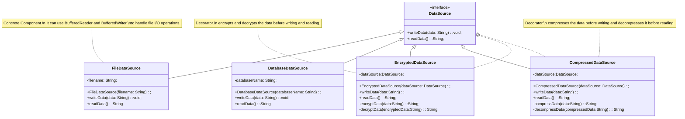

## Introduction

- Decorator is a structural design pattern that lets you attach new behaviors to objects by placing these objects inside special wrapper objects that contain the behaviors.

- Decorator is a pattern that also acts as a wrapper but only focuses on a single object. It works by changing the existing behavior of the object at runtime without extending it using a subclass.

- One analogy of this pattern is when you occupy a room and you want to embellish it with flowers. You do not alter anything in the room. Instead, you buy some flowers and make the room pretty and colorful. This is how Decorators work with objects as they enhance their behavior.

::: info GOF Defnition
It attaches additional responsibilities to an object dynamically. Decorators provide a flexible alternative to subclassing for extending functionality.
:::

## Components

**Component Interface:** This defines the interface for objects that can have additional responsibilities added dynamically. It is typically an abstract class or interface.

**Concrete Component:** This is the actual object to which additional functionality can be added. It implements the Component interface.

**Decorator:** This is an abstract class or interface that conforms to the Component interface. It has a reference to the Component object and provides a common interface for all concrete decorators.

**Concrete Decorators:** These are the actual decorator classes that extend the Decorator class. They add additional behavior to the Component objects by overriding methods and calling the Component's methods.

## When to Use ?

- **You have an object to which you want to attach multiple functions:** You have an operation or a method and you want to include actions to occur before or after you invoke it. Most of the time, this behavior would be beneficial to other services such as logging or monitoring but it is not limited to those cases. The major flexibility is that you can perform this conditional logic at runtime instead of at compile time.

- **You don't want to use inheritance for adding new behaviors:** You know that inheritance is not suitable because of the language constraints (for instance, you can only inherit from one class at a time in Java) or because it does not make sense to have it. In general terms, you should only rely on inheritance to support type checking operations and not for sharing code.

## Example

- In this example, we will implement the Decorator design pattern to enhance the functionality of a data source. The data source represents a file, and we apply decorators to add encryption and compression capabilities.

### UML Class Diagram



### Implementation

:::: details Code

```java
// DataSource interface
interface DataSource {
    void writeData(String data);
    String readData();
}
```

```java
import java.io.*;
// Concrete data source class
class FileDataSource implements DataSource {
    private String filename;

    public FileDataSource(String filename) {
        this.filename = filename;
    }

    public void writeData(String data) {
         try (BufferedWriter writer = new BufferedWriter(new FileWriter(filename))) {
            writer.write(data);
            System.out.println("Writing data to file: " + data);
        } catch (IOException e) {
            e.printStackTrace();
        }
    }

    public String readData() {
        StringBuilder data = new StringBuilder();
        try (BufferedReader reader = new BufferedReader(new FileReader(filename))) {
            String line;
            while ((line = reader.readLine()) != null) {
                data.append(line);
            }
            System.out.println("Reading data from file: " + filename);
        } catch (IOException e) {
            e.printStackTrace();
        }
        return data.toString();
    }
}
```

```java
// Decorator for adding encryption to data source
class EncryptedDataSource implements DataSource {
    private DataSource dataSource;

    public EncryptedDataSource(DataSource dataSource) {
        this.dataSource = dataSource;
    }

    public void writeData(String data) {
        // Encrypt the data
        String encryptedData = encryptData(data);
        dataSource.writeData(encryptedData);
    }

    public String readData() {
        String encryptedData = dataSource.readData();
        // Decrypt the data
        String data = decryptData(encryptedData);
        return data;
    }

    private String encryptData(String data) {
        // Actual encryption logic here
        System.out.println("Encrypting data: " + data);
        return "Encrypted data";
    }

    private String decryptData(String encryptedData) {
        // Actual decryption logic here
        System.out.println("Decrypting data: " + encryptedData);
        return "Decrypted data";
    }
}
```

```java
// Decorator for adding compression to data source
class CompressedDataSource implements DataSource {
    private DataSource dataSource;

    public CompressedDataSource(DataSource dataSource) {
        this.dataSource = dataSource;
    }

    public void writeData(String data) {
        // Compress the data
        String compressedData = compressData(data);
        dataSource.writeData(compressedData);
    }

    public String readData() {
        String compressedData = dataSource.readData();
        // Decompress the data
        String data = decompressData(compressedData);
        return data;
    }

    private String compressData(String data) {
        // Actual compression logic here
        System.out.println("Compressing data: " + data);
        return "Compressed data";
    }

    private String decompressData(String compressedData) {
        // Actual decompression logic here
        System.out.println("Decompressing data: " + compressedData);
        return "Decompressed data";
    }
}
```

```java
public class Main {
    public static void main(String[] args) {
        // Create a file data source
        DataSource fileDataSource = new FileDataSource("data.txt");

        // Add encryption to the file data source
        DataSource encryptedFileDataSource = new EncryptedDataSource(fileDataSource);

        // Add compression to the file data source
        DataSource compressedFileDataSource = new CompressedDataSource(encryptedFileDataSource);

        // Write and read data from file data source
        compressedFileDataSource.writeData("Hello, world!");
        String fileData = compressedFileDataSource.readData();
        System.out.println("Read data from file: " + fileData);
    }
}
```

::::

<Replit user="sumanthtatipamula" repl="DecoratorPattern" file="Main.java"/>
